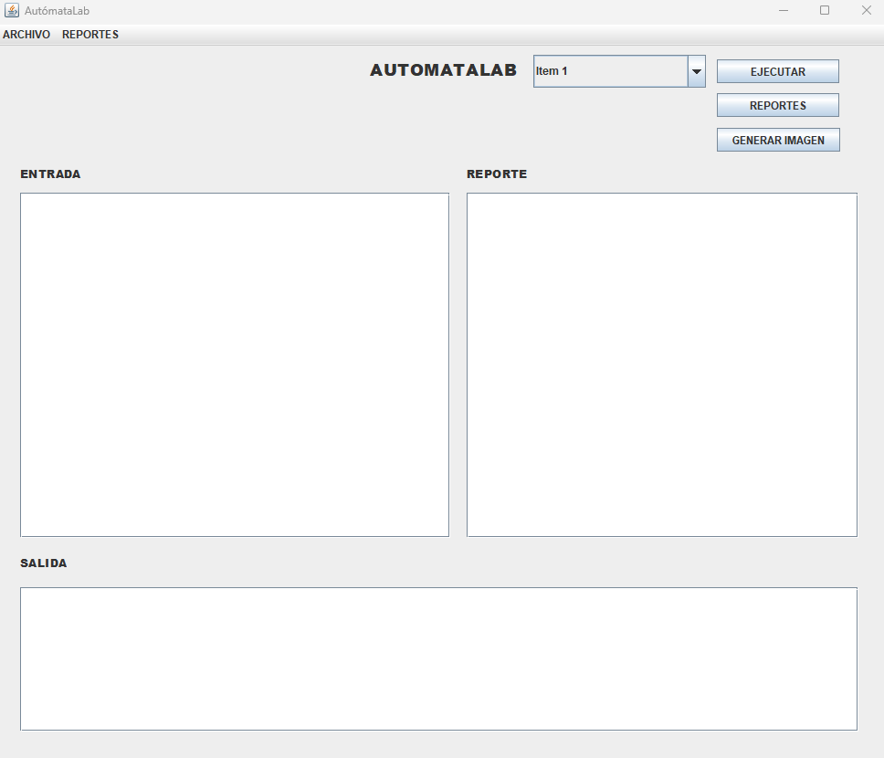
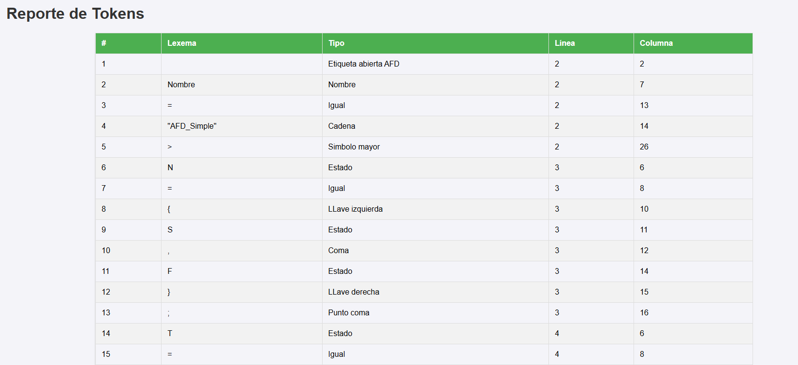
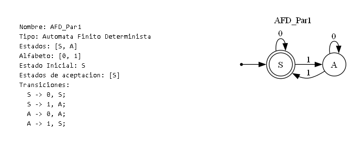
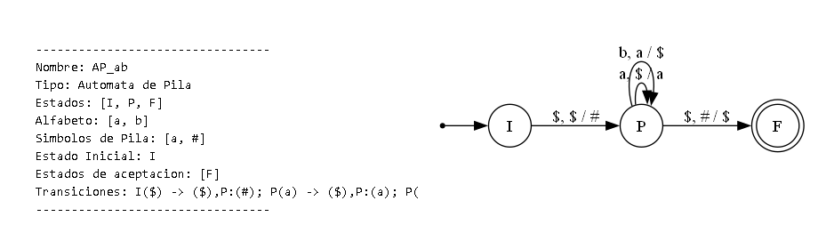

# Manual de Usuario - AutómataLab

## 1. Introducción

**AutómataLab** es una aplicación de escritorio diseñada para la creación, análisis y visualización de Autómatas Finitos Deterministas (AFD) y Autómatas de Pila (AP). Esta herramienta permite a los usuarios definir autómatas mediante un lenguaje específico, validar cadenas y generar reportes detallados, tanto textuales como gráficos.

## 2. Entorno de Trabajo

La interfaz principal de la aplicación está dividida en varias secciones para facilitar su uso.

- **Menú Superior:** Contiene las opciones de `ARCHIVO` (Nuevo, Abrir, Guardar) y `REPORTES` (para visualizar reportes de texto).
- **Panel de Controles:** Incluye un selector (`JComboBox`) para elegir un autómata, y los botones `EJECUTAR`, `REPORTES` (HTML) y `GENERAR IMAGEN`.
- **Área de Entrada:** (Izquierda) Es el editor de texto donde se escribe o se carga el código fuente (`.atm`) con las definiciones de los autómatas.
- **Área de Reporte:** (Derecha) Muestra los reportes de texto, como la tabla de tokens y errores.
- **Área de Salida:** (Inferior) Actúa como una consola, mostrando los resultados de la ejecución, como la confirmación de la creación de autómatas y los resultados de la validación de cadenas.

## 3. Funcionalidades Principales

### 3.1. Operaciones de Archivo (Menú `ARCHIVO`)

- **Nuevo:** Limpia todas las áreas de texto y controles de la interfaz, preparando el entorno para un nuevo análisis.
- **Abrir:** Abre un explorador de archivos que permite seleccionar y cargar un archivo con extensión `.atm`. El contenido del archivo se mostrará en el **Área de Entrada**.
- **Guardar:** Abre un explorador de archivos para guardar el contenido actual del **Área de Entrada** en un archivo `.atm`.

### 3.2. Análisis de Código (Botón `EJECUTAR`)

Una vez que el código está en el **Área de Entrada**, al presionar el botón `EJECUTAR`, la aplicación realiza las siguientes acciones:
1.  Analiza el código léxica y sintácticamente.
2.  Crea en memoria todos los autómatas definidos (AFD y AP).
3.  Puebla el selector de autómatas con los nombres de los autómatas creados.
4.  Ejecuta las funciones del lenguaje (`verAutomatas()`, `desc()`, `validarCadena()`) y muestra los resultados en el **Área de Salida**.
5.  Almacena la información de tokens y errores para la posterior generación de reportes.

### 3.3. Generación de Reportes

#### Reportes de Tokens y Errores
- **Botón `REPORTES` (HTML):** Genera dos archivos HTML, uno para los tokens y otro para los errores del último análisis ejecutado, y los abre automáticamente en el navegador web predeterminado.
- **Menú `REPORTES`:** Permite visualizar la misma información de tokens y errores directamente en el **Área de Reporte** de la aplicación.

#### Reportes Gráficos (Botón `GENERAR IMAGEN`)
Este botón se activa después de un análisis exitoso.
1.  Primero, se debe seleccionar un autómata de la lista desplegable.
2.  Al presionar el botón, un diálogo preguntará qué tipo de reporte se desea:
    - **Reporte de Autómata:** Genera una única imagen que muestra el grafo completo del autómata seleccionado junto a una tabla con su información detallada (estados, alfabeto, etc.). La imagen se guarda en la carpeta `src/Imagenes` y se abre automáticamente.
    
    
    
    - **Reporte de Pasos:** Pide al usuario que ingrese una cadena para validar. Luego, genera una o más imágenes que ilustran el proceso de validación paso a paso.
        - **Para AFD:** Crea una sola imagen del autómata completo con el camino recorrido resaltado en rojo.
        - **Para AP:** Crea una secuencia de imágenes, donde cada una muestra el estado actual, la entrada restante y el contenido de la pila en ese paso.
    
    